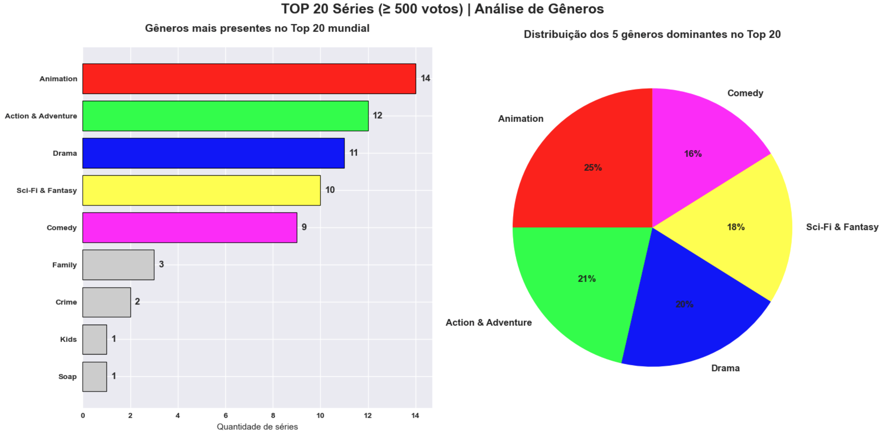
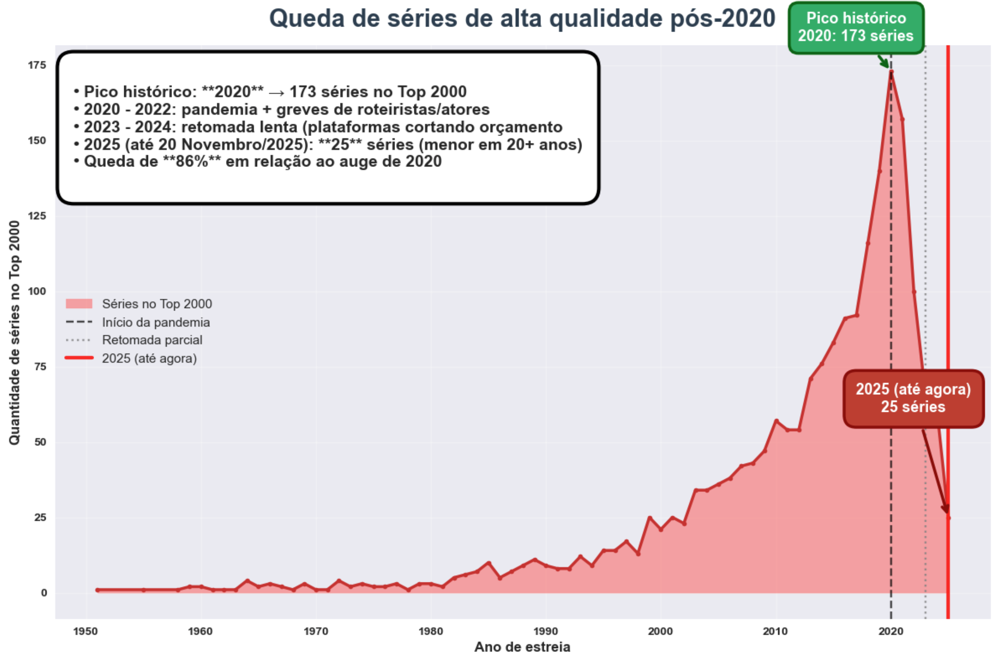
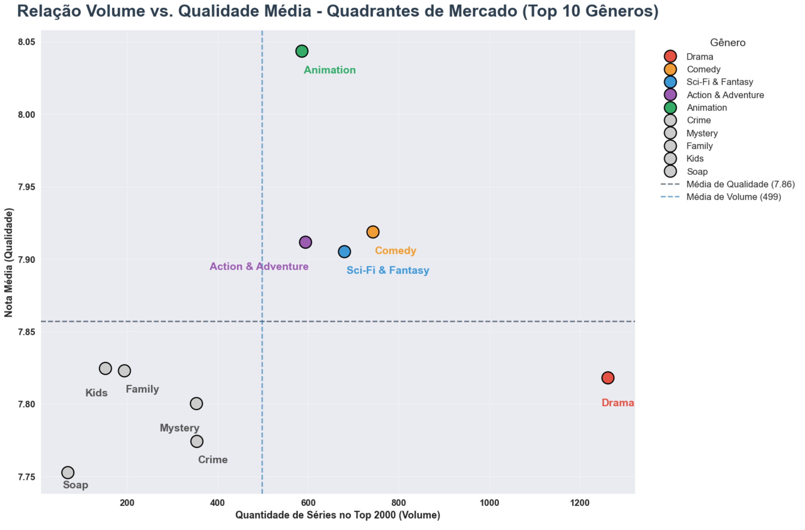
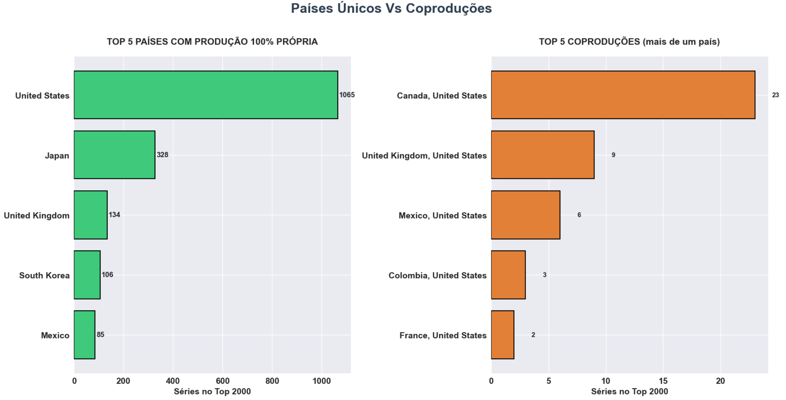
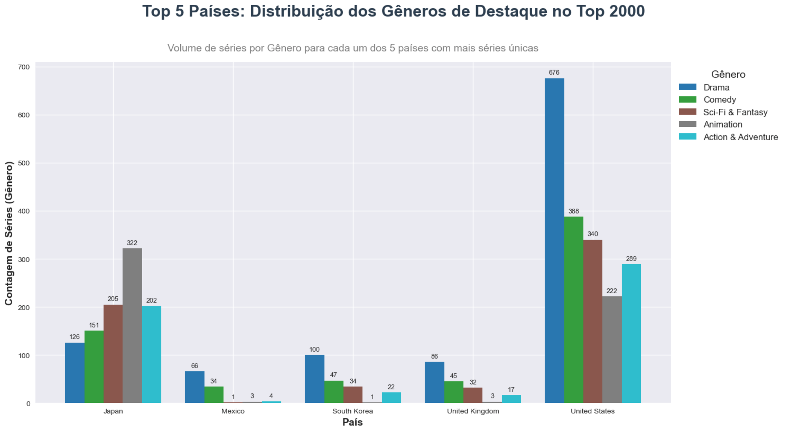

# Análise do Top 2000 Séries Mais Bem Avaliadas do Mundo (TMDB - 2025)

Projeto de análise exploratória de dados com foco em insights estratégicos do mercado de séries de TV e streaming.

**Principais temas abordados:**
- Colapso de produção pós-pandemia e greves
- Ascensão de Japão e Coreia do Sul com produção nacional
- Relação entre volume de séries e qualidade percebida
- Identificação de "joias escondidas" subvalorizadas pelo algoritmo

**Metodologia:**

**"Nota:** Os nomes de variáveis geográficas e linguísticas foram mantidos em seu formato original (inglês) para preservar a integridade dos dados extraídos via API do TMDB."

**Tecnologias:** Python, pandas, matplotlib, seaborn, Jupyter Notebook

**Autor:** Pablo Torres  
Analista de Dados em formação avançada, com sólida base em tecnologia e especialização em inteligência de negócios.  

- Graduado em Sistemas de Informação  
- Pós-graduado em Big Data para Business Analytics e Business Intelligence  
- Atualmente no 3º semestre de Ciência de Dados e Inteligência Artificial
---

## 📑 Sumário
1. [Insight 1: Top 15 Países — Concentração de Mercado](#insight-1-top-15-países--concentração-de-mercado)
2. [Insight 2: Top 15 Idiomas Originais — A Hegemonia do Inglês](#insight-2-top-15-idiomas-originais--a-hegemonia-do-inglês)
3. [Detalhamento: O Top 20 Mundial (Qualidade e Engajamento)](#detalhamento-o-top-20-mundial-qualidade-e-engajamento)
4. [Insight 3: Gêneros mais presentes + Distribuição 5 gêneros dominantes](#insight-3-gêneros-mais-presentes--distribuição-5-gêneros-dominantes)
5. [Insight 4: Queda de séries de alta qualidade pós-2020](#insight-4-queda-de-séries-de-alta-qualidade-pós-2020)
6. [Insight 5: Relação Volume vs. Qualidade Média - Quadrantes de Mercado](#insight-5-relação-volume-vs-qualidade-média---quadrantes-de-mercado)
7. [Insight 6: Países únicos VS Coproduções](#insight-6-países-únicos-vs-coproduções)
8. [Insight 7: Top 5 Países: Distribuição dos Gêneros de Destaque](#insight-7-top-5-países-distribuição-dos-gêneros-de-destaque)
9. [Insight 8: Top 10 Joias Escondidas Do Top 2000](#insight-8-top-10-joias-escondidas-do-top-2000)
10. [Insight 9: Popularidade vs Nota média - Conclusão Final do Projeto](#insight-9-popularidade-vs-nota-média---conclusão-final-do-projeto)
11. [Como rodar](#como-rodar)

---

### Insight 1: Top 15 Países — Concentração de Mercado
Os países dominantes no Top 2000 mostram uma centralização clara da produção audiovisual, com destaque absoluto para o mercado norte-americano:

* **United States:** 1.065 séries registradas.
* **Japan:** 328 séries, consolidando-se como a segunda maior força de produção no ranking.

Na base do Top 15, encontramos **Germany (11 séries)** e **Argentina (10 séries)**, que, apesar do volume menor, conseguem manter presença em um ranking altamente competitivo.


### Análise Técnica (1): Dispersão e Domínio de Mercado

A análise estatística revela um **Domínio Absoluto:** a diferença entre o primeiro e o segundo colocado é de **737 séries**. 
A **Dispersão Total** é ainda mais impressionante, com os United States possuindo **1.055 séries a mais** que a Argentina, último lugar do Top 15. 
Observa-se também um *Empate Técnico* na base do ranking, onde apenas uma série separa a Germany da Argentina.

---

### Insight 2: Top 15 Idiomas Originais — A Hegemonia do Inglês
A análise dos idiomas originais revela uma concentração ainda mais acentuada do que a geográfica, com o **English** estabelecendo um padrão global de consumo no Top 2000:

* **English:** Liderança absoluta com **1.265 séries**.
* **Japanese:** Segunda posição com **330 séries**, impulsionado pela forte exportação de animações (animes).

Na extremidade oposta do ranking, idiomas como **Swedish** e **Catalan** aparecem com apenas **2 séries cada**, evidenciando a dificuldade de produções em línguas locais escalarem para o topo das avaliações globais.


### Análise Técnica (2): Conclusão Estratégica e Nichos de Mercado

A hegemonia da língua inglesa é comprovada por uma margem de **935 séries** sobre o idioma japonês. Essa diferença massiva indica que o conteúdo de alto ranking é, em sua maioria, produzido ou distribuído originalmente em inglês. Entretanto, a baixa representação de outros idiomas abre uma **Oportunidade de Nicho:** plataformas podem se diferenciar ao investir em conteúdos de alta qualidade em línguas sub-representadas, como os **K-Dramas (Coreano)**, que já demonstram força com **106 séries** no ranking.

---

### Detalhamento: O Top 20 Mundial (Qualidade e Engajamento)
Antes de analisarmos os gêneros, esta visão tabular apresenta as produções que atingiram o ápice do ranking. Aqui, observamos a relação direta entre a **Nota Média** (mínimo de 8.6) e o **Total de Votos**, destacando fenômenos globais como Breaking Bad e Arcane.


---

### Insight 3: Gêneros mais presentes + Distribuição 5 gêneros dominantes

Com base na tabela acima, extraímos a distribuição categórica para entender o que define o sucesso no Top 20.

**RESUMO DO TOP 20 MUNDIAL (Qualidade vs. Gênero)**

* **Gênero absoluto:** Animation está presente em **14 das 20** séries do topo, representando 70% do pódio.

* **Hegemonia de Produção:** Apenas **4 países** dividem o Top 20, com destaque para **United States (11 séries)** e **Japan (7 séries)**.

* **Diversidade Linguística:** Apesar do domínio americano, **8 séries** no Top 20 não são originalmente em inglês (majoritariamente produções japonesas).




## Análise Técnica (3): Padrões de Sucesso e Rentabilidade

Observamos uma proximidade métrica entre os pilares do ranking que chamamos de **Quadrante de Ouro:** Animation, Action & Adventure, Drama e Sci-Fi & Fantasy. A distância entre o 1º lugar (Animation) e o 2º (Action & Adventure) é de apenas **2 unidades**, enquanto a dispersão total entre o 1º e o 4º colocado é de apenas **4 unidades**.

**Recomendação para Produtoras:** Para maximizar a aceitação global, o caminho validado pelos dados é o investimento em produções que mesclem esses quatro gêneros dominantes. Séries como **Breaking Bad (Drama/Crime)** e **Arcane (Animation/Sci-Fi)** exemplificam como atingir notas médias excepcionais (acima de 8.8) focando nesses nichos.

---

### Insight 4: Queda de séries de alta qualidade pós-2020

A análise histórica revela um cenário preocupante para a indústria: após atingir seu ápice em 2020, o volume de séries que conseguem entrar no Top 2000 sofreu uma retração drástica.

* **Pico Histórico (2020):** O ano de **2020** marcou o auge da qualidade percebida, com **173 séries** integrando o ranking global.

* **O Declínio Atual (2025):** Até novembro de 2025, apenas **25 séries** alcançaram os critérios do Top 2000, o menor volume registrado em mais de duas décadas.

* **Retração Crítica:** O mercado enfrenta uma **queda de 86%** na produção de séries de alta qualidade em relação ao topo de 2020.



### Análise Técnica (4): Contexto Industrial e Fatores de Queda

A trajetória descendente observada a partir de 2020 é resultado de uma combinação de fatores sistêmicos:

1. **2020 - 2022:** Paralisações causadas pela pandemia somadas às greves de roteiristas e atores em Hollywood.

2. **2023 - 2024:** Uma retomada lenta, marcada por plataformas de streaming cortando orçamentos e cancelando projetos precocemente.

---

### Insight 5: Relação Volume vs. Qualidade Média - Quadrantes de Mercado

A análise cruza a quantidade de séries produzidas com a avaliação média do público, permitindo identificar onde estão as saturações de mercado e as oportunidades de nicho.

### RESUMO DO MERCADO: VOLUME VS. QUALIDADE (TOP 10 GÊNEROS)

* **Volume Absoluto:** O gênero **Drama** lidera o mercado com **1.262 séries**, porém apresenta uma nota média de **7.818**, indicando uma diluição da qualidade pelo excesso de oferta.

* **Qualidade Absoluta (Outlier):** **Animation** é o grande destaque positivo, sendo o único gênero do Top 10 com nota média acima de 8.0 (**8.043**).



### Análise Técnica (5): Posicionamento Estratégico por Quadrante

Com base na distribuição dos dados, classificamos os gêneros em quatro quadrantes de investimento:

* **Saturação (Alto Volume / Baixa Qualidade):** Dominado por **Drama**, onde a relação inversa entre volume e qualidade é mais evidente.

* **Sucesso Consolidado (Alto Volume / Alta Qualidade):** **Comedy** e **Sci-Fi & Fantasy** conseguem manter o público engajado e bem avaliado mesmo com grande oferta.

* **Oportunidade de Nicho (Baixo Volume / Alta Qualidade):** Gêneros como **Kids (7.824)** e **Family (7.823)** são "joias escondidas" com alto potencial de satisfação para volumes menores de produção.

* **Risco de Investimento (Baixo Volume / Baixa Qualidade):** **Soap (7.753)** apresenta o menor desempenho em ambas as métricas, sendo o nicho menos valorizado no Top 2000.

---

### Insight 6: Países únicos VS Coproduções

Esta análise final explora como a produção 100% nacional se compara às parcerias entre países, revelando o papel central dos Estados Unidos como o maior parceiro de produção do mundo.

### RESUMO FINAL DOS PAÍSES E COPRODUÇÕES

### TOP 5 PAÍSES ÚNICOS (Produção 100% nacional):

* **United States:** Liderança absoluta com **mais de 1.000 séries**, consolidando o domínio de Hollywood.

* **Japan:** Mais de **300 séries**, impulsionado pela forte indústria de animações nacionais.

* **South Korea:** Pouco mais de **100 séries**, refletindo a ascensão global dos K-dramas.

**Mexico:** Encerra o ranking de países únicos, com destaque para o gênero Sci-Fi & Fantasy.

### TOP 5 COPRODUÇÕES (Alianças Estratégicas):

* **Canada & United States:** 23 séries (maior aliança do ranking).

* **United Kingdom & United States:** 9 séries.

* **Mexico & United States:** 6 séries.



### Análise Técnica (6): Visões Principais sobre Independência e Parceria

* **Domínio Absoluto dos EUA:** Além da liderança em produção própria, os EUA são o parceiro indispensável em **todas** as Top 5 coproduções do ranking.

* **Produção Pura (Nicho):** Japão e Coreia do Sul destacam-se por manterem altos volumes de produção de elite de forma **autônoma**, sem depender de parcerias externas para figurar no Top 2000.

**Estratégia de Parceria:** Observa-se um foco dos EUA em parcerias no eixo **América do Norte/Reino Unido**, seguidas estrategicamente por colaborações na **América Latina (México e Colômbia)** para expansão de mercado.

---

### Insight 7: Top 5 Países: Distribuição dos Gêneros de Destaque

Esta análise compara como as empresas do entretenimento distribuem seus investimentos entre os principais gêneros, revelando estratégias distintas para figurar no Top 2000.

### VISÕES: ESPECIALIZAÇÃO POR PAÍS E ESTRATÉGIA DE CONTEÚDO

* **Domínio Americano:** Os Estados Unidos lideram em volume em quase todas as categorias, com destaque para **Drama (676 séries)**, **Comedy (388)** e **Sci-Fi & Fantasy (340)**.

* **Estratégia de Nicho (Japão):** O **Japan** é o único país que supera os EUA em uma categoria específica, consolidando-se como o especialista global em **Animation** com **322 séries**.

* **Foco Regional (Coreia do Sul):** A **South Korea** concentra sua força quase exclusivamente em **Drama (100 séries)**, validando a ascensão e a alta qualidade dos K-dramas no ranking global.



### Análise Técnica (7): Conclusão de Mercado e Competitividade

Os dados provam que existem dois caminhos para o sucesso no Top 2000:

**Amplitude (Modelo Hollywood):** Dominar múltiplos gêneros através de grandes volumes de produção.

**Especialização (Modelo Ásia):** Para competir com a amplitude americana, o sucesso é alcançado através da **excelência em um único gênero** (como o Japão em Animação ou a Coreia em Drama), criando uma marca nacional forte e reconhecível pelo público global.

---

### Insight 8: Top 10 Joias Escondidas Do Top 2000 (Oportunidade de Mercado)

Esta análise identifica títulos de altíssima qualidade que operam "fora do radar" do grande público, representando uma oportunidade estratégica para curadoria de conteúdo em plataformas de streaming.

### JOIAS ESCONDIDAS: SÉRIES QUE MERECEM SER DESCOBERTAS

* **Qualidade de Elite:** Identificamos **17 séries** com nota média ≥ 8.4 que figuram no fundo do ranking de popularidade.

* **Baixo Alcance:** Todas as séries desta lista estão abaixo de **2.9** no índice de popularidade (Top 10% menos populares da base).

* **Média de Popularidade:** O grupo apresenta uma média de apenas **2.1**, evidenciando um grande potencial de crescimento de audiência.

* **Perfil de Produção:** A maioria desses títulos é composta por animes japoneses, K-dramas e produções europeias ou independentes.


### Análise Técnica (8): A Prova Definitiva (Popularidade ≠ Qualidade)

A análise estatística deste subconjunto prova que **Popularidade não é sinônimo de Qualidade**. Séries como Blue Planet II e Villainous mantêm notas excepcionais de **8.6**, mas com popularidade abaixo de 2.6.

**Ação Estratégica**: Estas são as produções que as empresas de streaming deveriam priorizar em seus algoritmos de recomendação. Ao dar visibilidade a essas "joias", as plataformas aumentam o valor agregado percebido pelo assinante sem a necessidade de novos investimentos em produção.

---

### Insight 9: Popularidade vs Nota média - Conclusão Final do Projeto

Este gráfico de dispersão com linha de tendência resume o grande aprendizado desta análise: o sucesso comercial e a aclamação crítica nem sempre caminham juntos no mercado audiovisual.

### PRINCIPAIS CONCLUSÕES DA CORRELAÇÃO:

* **Relação Desconexa:** Embora exista uma correlação positiva, ela é estatisticamente **FRACA (R² < 0.3$)**, provando que o alcance de massa não garante uma nota de elite.
* **Obras-Primas Ocultas:** O quadrante superior esquerdo do gráfico revela dezenas de séries com nota **≥ 8.4** que permanecem desconhecidas pelo grande público.
* **Novos Polos de Qualidade:** Enquanto Hollywood domina a visibilidade (quadrante inferior direito), países como **Japão, Coreia do Sul** e produtoras independentes dominam as "joias escondidas" de qualidade absoluta.


### Análise Técnica (9): Síntese Estratégica

A análise final demonstra que a indústria do entretenimento possui um vasto inventário de alta qualidade subutilizado. A dominância de visibilidade americana não reflete mais a soberania qualitativa, abrindo espaço para que plataformas de streaming se tornem curadoras globais, conectando o público a essas obras-primas independentes.

---

> Obrigado por acompanhar meu projeto. Me empenhei muito nele.
> 
> Se você busca um profissional com foco em transformar dados brutos em decisões inteligentes, vamos conversar:

* **LinkedIn:** [Pablo Torres](https://www.linkedin.com/in/pablo-torres-2a6972239/) 
* **GitHub:** [Ver outros projetos](https://github.com/PabloAim) 
* **Email:** pabloaim@icloud.com

---

### Como rodar

Para replicar esta análise em sua máquina local, siga os passos abaixo:

```bash
# Clone o repositório
git clone https://github.com/PabloAim/top_rated_2000webseries

# Entre na pasta do projeto
cd top_rated_2000webseries

# Instale as dependências necessárias
pip install pandas matplotlib seaborn jupyter

# Inicie o Jupyter Notebook para visualizar a análise
jupyter notebook
