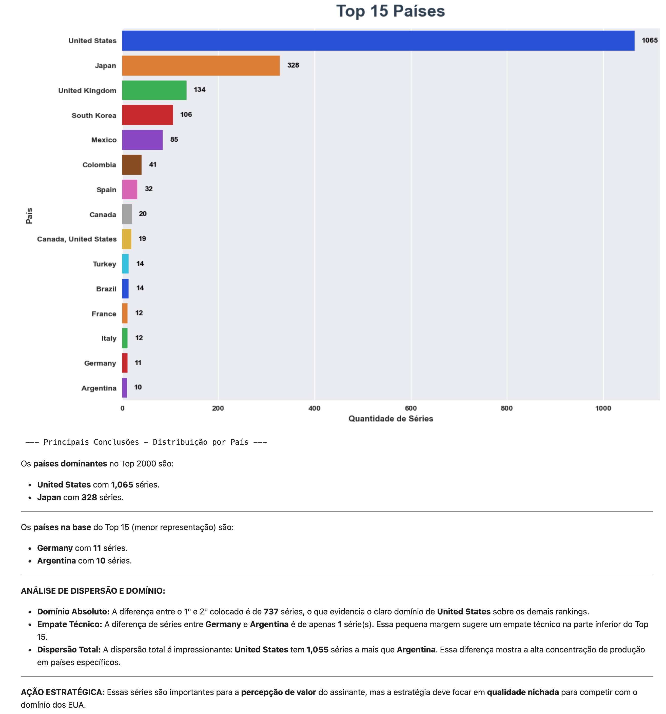
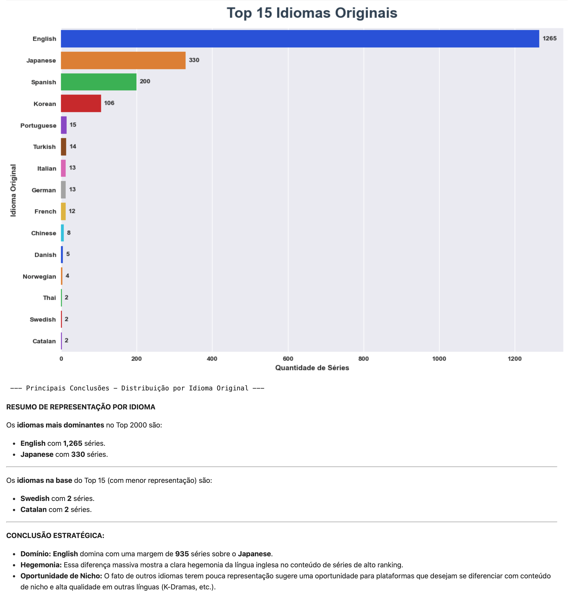
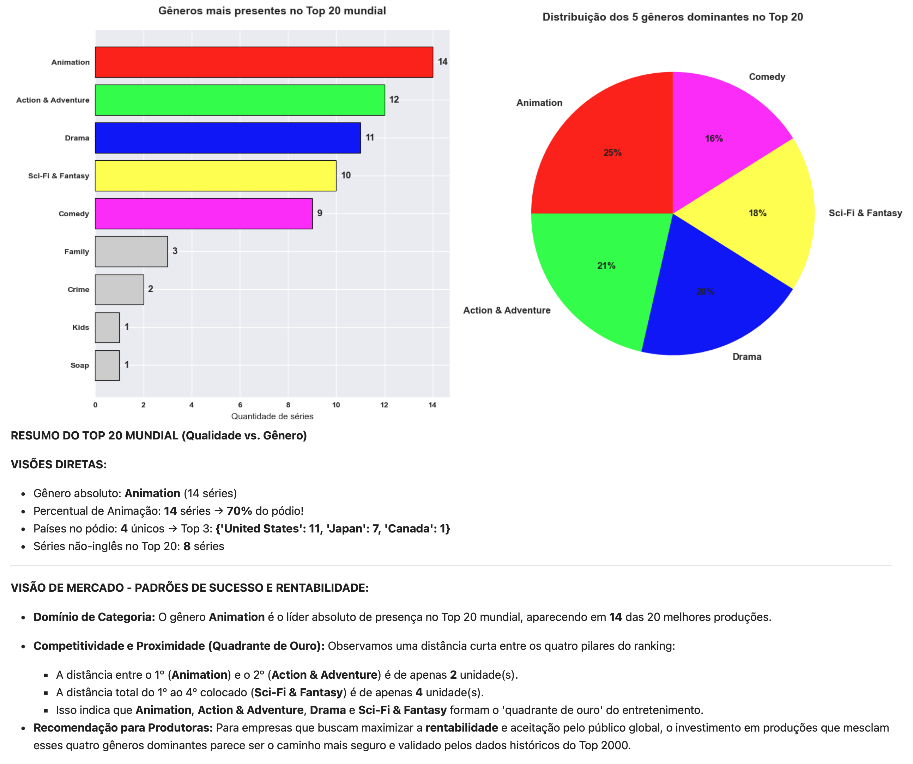
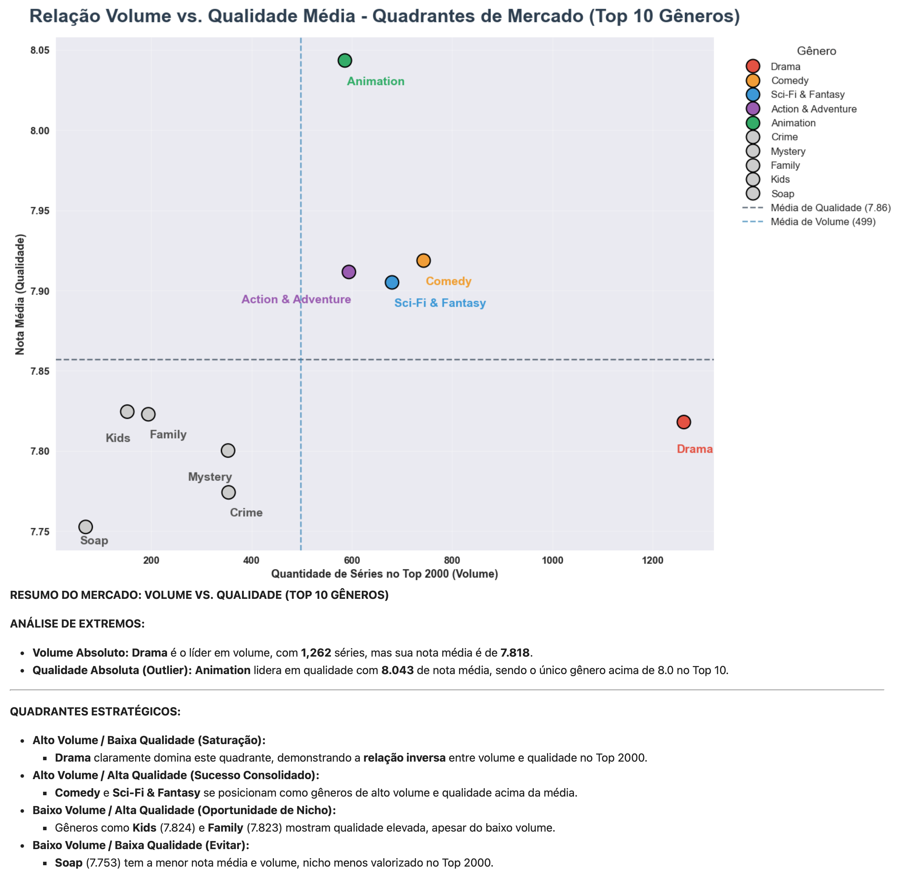
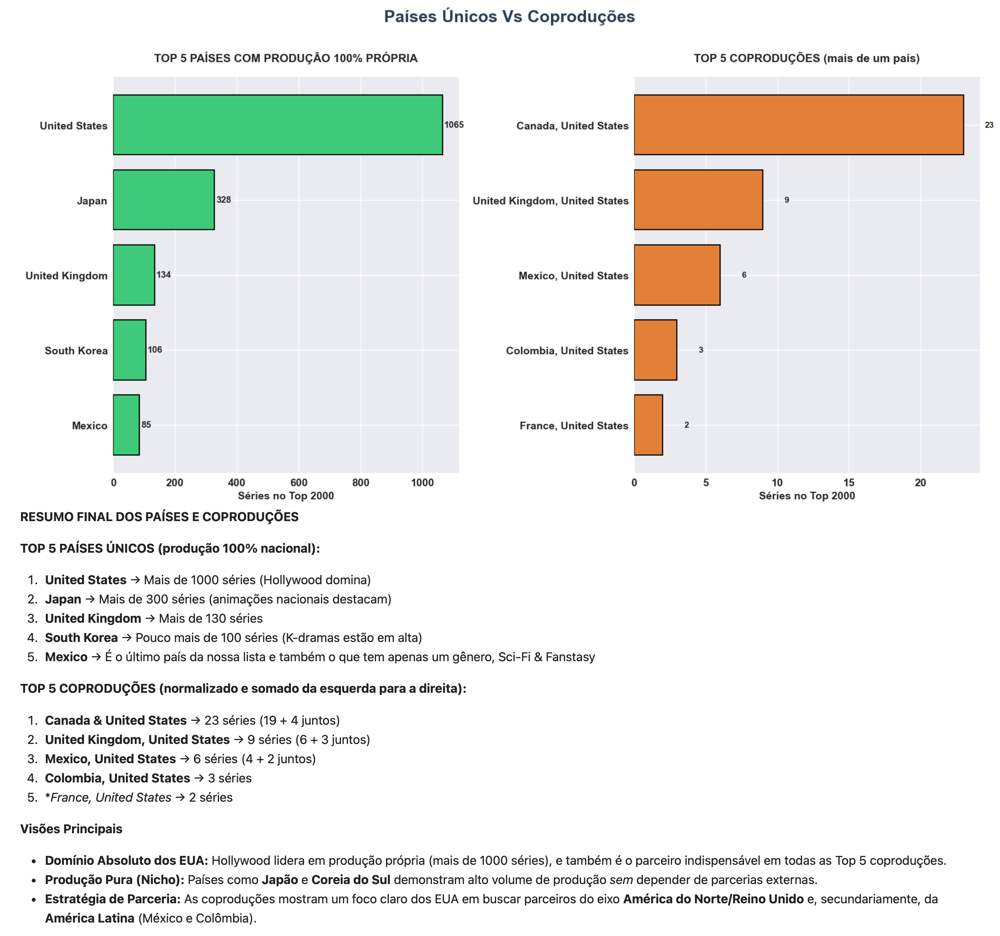
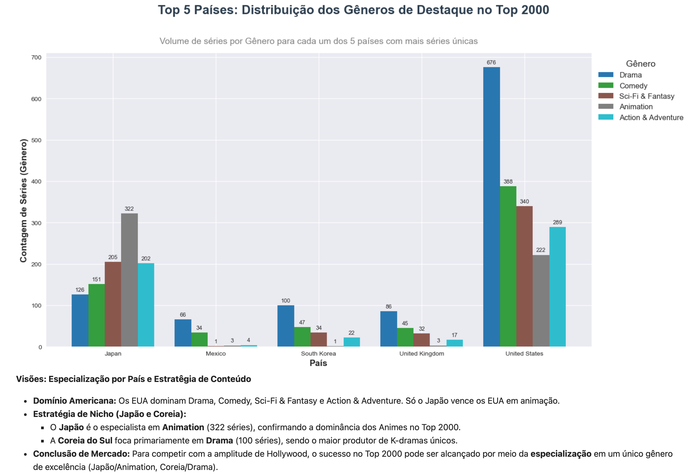
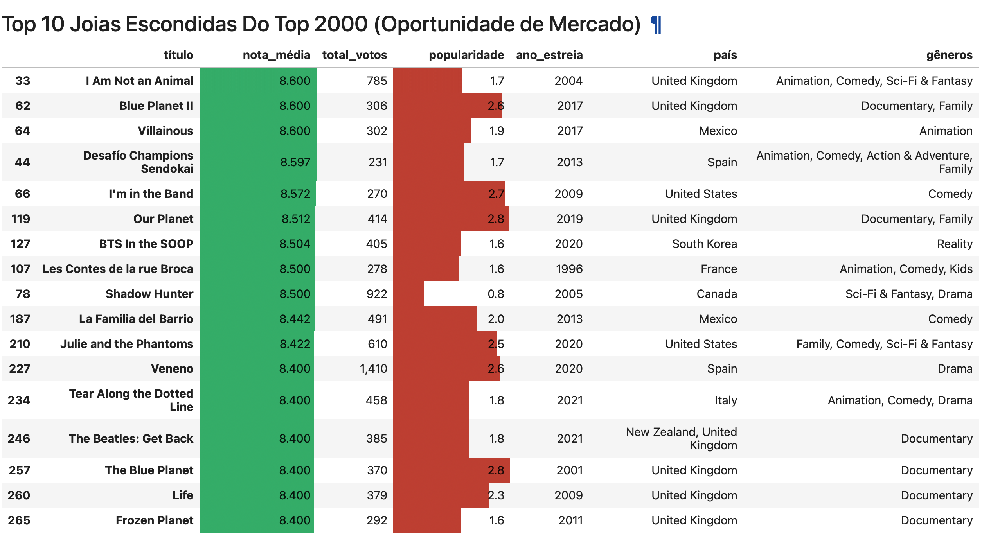
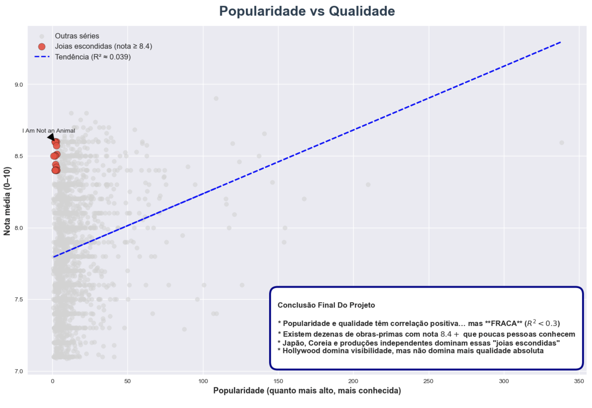

# Análise do Top 2000 Séries Mais Bem Avaliadas do Mundo (TMDB - 2025)

Projeto de análise exploratória de dados com foco em insights estratégicos do mercado de séries de TV e streaming.

**Principais temas abordados:**
- Colapso de produção pós-pandemia e greves
- Ascensão de Japão e Coreia do Sul com produção nacional
- Relação entre volume de séries e qualidade percebida
- Identificação de "joias escondidas" subvalorizadas pelo algoritmo

**Tecnologias:** Python, pandas, matplotlib, seaborn, Jupyter Notebook

**Autor:** Pablo Torres  
Analista de Dados em formação avançada, com sólida base em tecnologia e especialização em inteligência de negócios.  

- Graduado em Sistemas de Informação  
- Pós-graduado em Big Data para Business Analytics e Business Intelligence  
- Atualmente no 3º semestre de Ciência de Dados e Inteligência Artificial

---

### Insight 1: Top 15 Países

Os **países dominantes** no Top 2000 são:
* **{primeiro_pais}** com **{primeira_contagem:,}** séries.
* **{segundo_pais}** com **{segunda_contagem:,}** séries.

---

Os **países na base** do Top 15 (menor representação) são:
* **{penultimo_pais}** com **{penultima_contagem}** séries.
* **{ultimo_pais}** com **{ultima_contagem}** séries.

---

**ANÁLISE DE DISPERSÃO E DOMÍNIO:**
* **Domínio Absoluto:** A diferença entre o 1º e 2º colocado é de **{diferenca_top2:,}** séries, o que evidencia o claro domínio de **{primeiro_pais}** sobre os demais rankings.
* **Empate Técnico:** A diferença de séries entre **Germany** e **Argentina** é de apenas **1** série(s). Essa pequena margem sugere um empate técnico na parte inferior do Top 15.
* **Dispersão Total:** A dispersão total é impressionante: **United States** tem **1,055** séries a mais que **Argentina**. Essa diferença mostra a alta concentração de produção em países específicos.

---

**AÇÃO ESTRATÉGICA:** Essas séries são importantes para a **percepção de valor** do assinante, mas a estratégia deve focar em **qualidade nichada** para competir com o domínio dos EUA.

### Insight 2: Top 15 Idiomas Originais

**RESUMO DE REPRESENTAÇÃO POR IDIOMA**

Os **idiomas mais dominantes** no Top 2000 são:
* **{primeiro_idioma}** com **{primeira_contagem:,}** séries.
* **{segundo_idioma}** com **{segunda_contagem:,}** séries.

---

Os **idiomas na base** do Top 15 (com menor representação) são:
* **{penultimo_idioma}** com **{penultima_contagem}** séries.
* **{ultimo_idioma}** com **{ultima_contagem}** séries.

---

**CONCLUSÃO ESTRATÉGICA:**
* **Domínio:** **{primeiro_idioma}** domina com uma margem de **{diferenca_top2:,}** séries sobre o **{segundo_idioma}**.
* **Hegemonia:** Essa diferença massiva mostra a clara hegemonia da língua inglesa no conteúdo de séries de alto ranking.
* **Oportunidade de Nicho:** O fato de outros idiomas terem pouca representação sugere uma oportunidade para plataformas que desejam se diferenciar com conteúdo de nicho e alta qualidade em outras línguas (K-Dramas, etc.).

### Insight 3: Gêneros mais presentes + Distribuição 5 gêneros dominantes

**RESUMO DO TOP 20 MUNDIAL (Qualidade vs. Gênero)**

**VISÕES DIRETAS:**
* Gênero absoluto: **{contagem.index[0]}** ({contagem.iloc[0]} séries)
* Percentual de Animação: **{contagem.get('Animation', 0)}** séries → **{(contagem.get('Animation', 0)/20*100):.0f}%** do pódio!
* Países no pódio: **{top_20['país'].nunique()}** únicos → Top 3: **{top_20['país'].value_counts().head(3).to_dict()}**
* Séries não-inglês no Top 20: **{len(top_20[top_20['idioma_original'] != 'English'])}** séries

---

**VISÃO DE MERCADO - PADRÕES DE SUCESSO E RENTABILIDADE:**
* **Domínio de Categoria:** O gênero **{top_1_gen}** é o líder absoluto de presença no Top 20 mundial, aparecendo em **{contagem.values[0]}** das 20 melhores produções.

* **Competitividade e Proximidade (Quadrante de Ouro):** Observamos uma distância curta entre os quatro pilares do ranking:
    * A distância entre o 1º (**{top_1_gen}**) e o 2º (**{top_2_gen}**) é de apenas **{gap_1_2}** unidade(s).
    * A distância total do 1º ao 4º colocado (**{top_4_gen}**) é de apenas **{gap_1_4}** unidade(s).
    * Isso indica que **{top_1_gen}**, **{top_2_gen}**, **{top_3_gen}** e **{top_4_gen}** formam o 'quadrante de ouro' do entretenimento.
    
* **Recomendação para Produtoras:** Para empresas que buscam maximizar a **rentabilidade** e aceitação pelo público global, o investimento em produções que mesclam esses quatro gêneros dominantes parece ser o caminho mais seguro e validado pelos dados históricos do Top 2000.

### Insight 4: Queda de séries de alta qualidade pós-2020

• Pico histórico: **{pico_ano}** → {pico_valor} séries no Top 2000
• 2020 - 2022: pandemia + greves de roteiristas/atores
• 2023 - 2024: retomada lenta (plataformas cortando orçamento
• 2025 (até 20 Novembro/2025): **{fundo_2025}** séries (menor em 20+ anos)
• Queda de **{queda_percentual:.0f}%** em relação ao auge de 2020

### Insight 5: Relação Volume vs. Qualidade Média - Quadrantes de Mercado (Top 10 Gêneros)

**RESUMO DO MERCADO: VOLUME VS. QUALIDADE (TOP 10 GÊNEROS)**

**ANÁLISE DE EXTREMOS:**
* **Volume Absoluto:** **Drama** é o líder em volume, com **{top10_qtd.loc['Drama']:,}** séries, mas sua nota média é de **{media_genero.loc['Drama']:.3f}**.
* **Qualidade Absoluta (Outlier):** **Animation** lidera em qualidade com **{media_genero.loc['Animation']:.3f}** de nota média, sendo o único gênero acima de 8.0 no Top 10.

---

**QUADRANTES ESTRATÉGICOS:**

* **Alto Volume / Baixa Qualidade (Saturação):**
    * **Drama** claramente domina este quadrante, demonstrando a **relação inversa** entre volume e qualidade no Top 2000.
* **Alto Volume / Alta Qualidade (Sucesso Consolidado):**
    * **Comedy** e **Sci-Fi & Fantasy** se posicionam como gêneros de alto volume e qualidade acima da média.
* **Baixo Volume / Alta Qualidade (Oportunidade de Nicho):**
    * Gêneros como **Kids** ({media_genero.loc['Kids']:.3f}) e **Family** ({media_genero.loc['Family']:.3f}) mostram qualidade elevada, apesar do baixo volume.
* **Baixo Volume / Baixa Qualidade (Evitar):**
    * **Soap** ({media_genero.loc['Soap']:.3f}) tem a menor nota média e volume, nicho menos valorizado no Top 2000.

### Insight 6: Países únicos VS Coproduções

**RESUMO FINAL DOS PAÍSES E COPRODUÇÕES**

**TOP 5 PAÍSES ÚNICOS (produção 100% nacional):**  
1. **United States** → Mais de 1000 séries (Hollywood domina)  
2. **Japan** → Mais de 300 séries (animações nacionais destacam) 
4. **United Kingdom** → Mais de 130 séries  
3. **South Korea** → Pouco mais de 100 séries (K-dramas estão em alta)  
5. **Mexico** → É o último país da nossa lista e também o que tem apenas um gênero, Sci-Fi & Fanstasy  

**TOP 5 COPRODUÇÕES (normalizado e somado da esquerda para a direita):**  
1. **Canada & United States** → 23 séries (19 + 4 juntos)
2. **United Kingdom, United States** → 9 séries (6 + 3 juntos)
3. **Mexico, United States** → 6 séries  (4 + 2 juntos)
4. **Colombia, United States** → 3 séries
5. **France, United States** → 2 séries

**Visões Principais**
- **Domínio Absoluto dos EUA:** Hollywood lidera em produção própria (mais de 1000 séries), e também é o parceiro indispensável em todas as Top 5 coproduções.
- **Produção Pura (Nicho):** Países como **Japão** e **Coreia do Sul** demonstram alto volume de produção *sem* depender de parcerias externas.
- **Estratégia de Parceria:** As coproduções mostram um foco claro dos EUA em buscar parceiros do eixo **América do Norte/Reino Unido** e, secundariamente, da **América Latina** (México e Colômbia).

### Insight 7: Top 5 Países: Distribuição dos Gêneros de Destaque no Top 2000 

**Visões: Especialização por País e Estratégia de Conteúdo**

- **Domínio Americana:** Os EUA dominam Drama, Comedy, Sci-Fi & Fantasy e Action & Adventure.  Só o Japão vence os EUA em animação.
- **Estratégia de Nicho (Japão e Coreia):**
    - O **Japão** é o especialista em **Animation** (322 séries), confirmando a dominância dos Animes no Top 2000.
    - A **Coreia do Sul** foca primariamente em **Drama** (100 séries), sendo o maior produtor de K-dramas únicos.
- **Conclusão de Mercado:** Para competir com a amplitude de Hollywood, o sucesso no Top 2000 pode ser alcançado por meio da **especialização** em um único gênero de excelência (Japão/Animation, Coreia/Drama).

### Insight 8: Top 10 Joias Escondidas Do Top 2000 (Oportunidade de Mercado)

**Joias Escondidas - Séries Que Merecem Ser Descobertas**

* **{len(joias_escondidas)}** séries com nota ≥ 8.4 estão no fundo do ranking de popularidade
* **Corte de Popularidade:** Todas as séries estão abaixo do **{df['popularidade'].quantile(0.10):.1f}** (Top 10% menos populares)
* Média de popularidade dessas séries: {joias_escondidas['popularidade'].mean():.1f}
* Muitos são animes japoneses, K-dramas ou produções europeias/independentes (Confirmando o insight da Célula 13)
* **Prova definitiva:** Popularidade ≠ Qualidade

**Ação Estratégica:** Essas são as séries que as empresas de streaming deveriam estar empurrando no algoritmo para aumentar o valor agregado pelo assinante!

### Insight 9: Popularidade vs Nota média

Conclusão Final Do Projeto

* Popularidade e qualidade têm correlação positiva… mas **FRACA** (R² < 0.3)
* Existem dezenas de obras-primas com nota ≥ 8.4 que poucas pessoas conhecem
* Japão, Coreia e produções independentes dominam essas "joias escondidas"
* Hollywood domina visibilidade, mas não domina mais qualidade absoluta

## Gráficos Principais

### 1. Top 15 Países


### 2. Top 15 Idiomas


### 3. Top 20 Séries


### 4. Gêneros mais presentes e distribuição dominante


### 5. Queda de séries de qualidade pós-2020


### 6. Relação volume vs qualidade


### 7. Países únicos vs coproduções


### 8. Top 5 Países: Distribuição dos Gêneros de Destaque


### 9. Joias Escondidas do Top 2000


### 10. Popularidade vs qualidade


## Como rodar
```bash
git clone https://github.com/PabloAim/top_rated_2000webseries.git
cd top_rated_2000webseries
pip install pandas matplotlib seaborn jupyter
jupyter notebook
